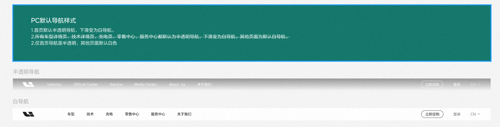
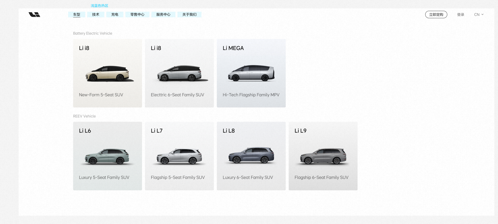
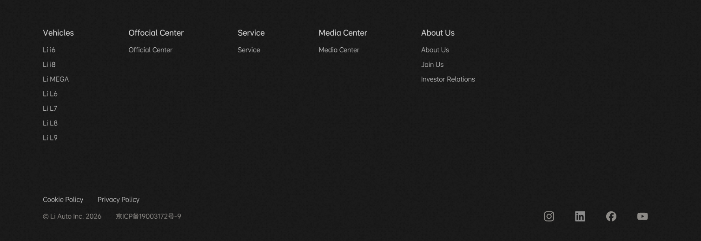
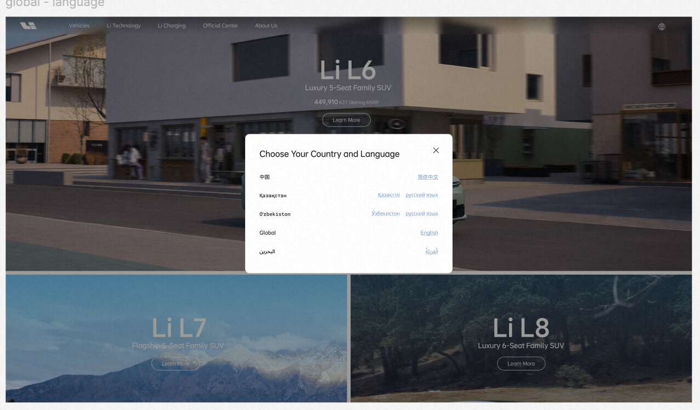

# 导航组件 · 使用与配置手册

> 依据 [`官网组件清单.md`](./官网组件清单.md)（客户建议拆分）编写，覆盖**导航 3 个组件**：header、页脚、地区/语言切换 Tab。
> 面向对象：Universal Editor 内容作者 + 前端开发。

## 与首页组件的关键差异：导航是独立 fragment，主导航仍使用 UE 结构化字段

Header 和 footer 的内容来自作者维护的两份**独立文档（fragment）**。Header 的 Primary section 使用 `Header Navigation` 容器和短字段 dialog；作者不再维护嵌套 Rich Text HTML。

| 组件 | 内容来源文档 | 覆盖元数据 | 加载方式 |
| --- | --- | --- | --- |
| header | 当前语言根下的 `/nav`，如 `/ae/ar/nav` | 页面 `nav` 元数据可覆盖路径 | `getFragmentCandidates()` + `loadFragment()` |
| 页脚 footer | 当前语言根下的 `/footer`，如 `/kz/ru/footer` | 页面 `footer` 元数据可覆盖路径 | `getFragmentCandidates()` + `loadFragment()` |

作者编辑 `/nav`、`/footer` 两篇文档。`/nav` 的主导航、语言设置通过 UE Block dialog 管理；`/footer` 仍按语义标题和链接列表解析。Header 保留旧 Rich Text list 回退，但新内容不得继续用它扩展导航。

> 内容环境：`author-p80707-e1685574.adobeaemcloud.com`，站点根 `/content/demo-site`。开发基准页仍是 `/language-master/en/homepage`；正式对外站点使用同层的 `/en`、`/ae`、`/sa`、`/nl`、`/kw`、`/kz`、`/uz`。

---

## 1. header（全局顶部导航）

**优先级 P0** · 对应 block：`header`（`/nav` 文档驱动）

### 用途
全站顶部导航。承载品牌 Logo、主导航入口、车型 mega 面板、右侧工具区（立即定购 / 登录 / 语言）。

### `/nav` 文档结构（作者编辑对象）
header.js 把 `/nav` 文档按 **3 个 section** 顺序解析：

| section | 角色 | 作者放什么 |
| --- | --- | --- |
| 第 1 段 | **Brand 品牌** | 一个带图片的链接：Logo 图 + 首页链接（`brandLink`/`brandImg`/`brandImgAlt`） |
| 第 2 段 | **Primary 主导航** | `Header Navigation` 容器；按顺序添加 Main Navigation Link、Dropdown Section Heading、Dropdown Link Card 子项 |
| 第 3 段 | **Tools/Language 工具区** | 语言入口链接 + `Header Settings`（locale directory 和本地化无障碍文案） |

### 结构化条目与车型 mega 面板

`Header Navigation` 只允许添加以下三种子项；每个 dialog 只显示该类型需要的短字段，车型卡片共 5 个字段：

| 子项 | 字段 | 用途 |
| --- | --- | --- |
| Main Navigation Link | Link Text、Target Page or URL | 新建一级菜单；使用文件夹按钮从 `/content/demo-site` 选择页面 |
| Dropdown Section Heading | Section Heading | 给最近的一级菜单新增面板分组 |
| Dropdown Link Card | Link Card Title、Target Page or URL、Card Background Image、Vehicle Logo Image、Short Description | 给最近的一级菜单/分组新增卡片；背景图和可选透明字标分别从 DAM 选择，不再依赖图片选择顺序 |

容器自身的 `Shared Card Action Text` 配置当前语言共享 CTA，例如 `Learn More`。内容顺序就是归属关系：一个 Main Navigation Link 后面的 Heading/Card 都属于它，直到出现下一个 Main Navigation Link。

Author 画布会把每个条目显示成同级编辑卡片，而不是最终网站的嵌套菜单。卡片顶部显示顺序和类型，下面显示已选路径、描述和图片数量；虚线卡片表示仍有字段未配置。点击某一张卡片再打开 Properties，只会编辑对应条目。

- 卡片 = 车型名（title）+ 定位文案（description）+ 背景车图（backgroundImage）+ 可选透明字标（logoImage）+ 容器共享 CTA。
- 分组示例（截图）：**Battery Electric Vehicle**（Li i6 / Li i8 / Li MEGA）、**REEV Vehicle**（Li L6 / L7 / L8 / L9）。分组名来自 Dropdown Section Heading。
- 导航项 hover 有浅蓝色热区触发面板。

### 主题（透明 / 白色）
- 由页面 `header-theme` 元数据 + 滚动状态控制。
- **客户最终规则**：**仅首页导航半透明**（下滑变为白导航）；**其他页面默认白导航**。
  （截图中「所有车型/技术/充电/零售/服务页也半透明」一条已被划掉，以「仅首页半透明」为准。）

### 响应式与 Header 组件断点

- 全站仍采用三档布局：大屏 `1441px+`、中屏 `720-1440px`、小屏 `719px-`。
- Header 有一个独立的 `1000px` 行为断点，不是第四套全站布局：
  - `>=1000px`：桌面主导航；首页顶部为渐变 + `20px` 背景模糊。
  - `<1000px`：汉堡菜单；首页顶部完全透明，无渐变、无背景模糊。
- 两种透明态都覆盖首个组件，不预留 `50px` 文档流高度。
- 滚动超过 `10px`、打开汉堡菜单、桌面面板或地区/语言弹窗时，统一切换为白底、无模糊、深色 Logo/图标。

### 作者操作
1. 打开 `/nav` 文档。
2. 第 1 段放 Logo 图 + 首页链接。
3. 第 2 段选择 `Header Navigation`；通过 Add 添加 Main Navigation Link / Dropdown Section Heading / Dropdown Link Card。
4. 在画布中选中一张编辑卡片并打开 Properties。编辑 Link 或 Card 时，点击 `Target Page or URL` 右侧的文件夹按钮，从 `/content/demo-site` 选择页面；不要手输 `/service` 之类根相对路径。车型卡片分别通过 `Card Background Image` 和 `Vehicle Logo Image` 选择 DAM 资源，Logo 应使用透明 PNG；不要再把两张图片放进一个多选字段。
5. 通过 Content Tree 拖动条目调整顺序；Heading/Card 必须放在所属 Main Navigation Link 后面。橙色提示表示该条目还没有上级菜单。
6. 第 3 段选择 `Header Settings` 配置语言目录和本地化 label。
7. 各页需要透明头时设 `header-theme` 元数据（默认白；首页设半透明）。

> 迁移说明：页面仍可保留旧 Core Text 列表作为回退；只要同一 Primary section 中存在有效 `Header Navigation`，运行时就优先使用结构化内容。

> 测试资产说明：`/content/dam/li-auto/intake/global/header-navigation-test` 仅用于 Header Navigation 的 Author/EDS 发布验证，不是正式资产目录。正式上线前必须把获批素材迁入 `/content/dam/li-auto/shared/vehicles/<model>/homepage`（或替换为该目录既有正式资产）、更新引用并重新发布；不得长期从 `intake` 提供生产页面素材。

### ⚠️ 已知差距
- 右侧「立即定购 / 登录」按钮在不同市场截图中有/无（Global 版只有地球图标，无登录/定购）——需确认是否按 market 控制。

---

## 2. 页脚 footer

**优先级 P0** · 对应 block：`footer`（`/footer` 文档驱动）

### 用途
全站底部：多列链接导航 + 法务信息 + 社交媒体 + 回到顶部。

### `/footer` 文档结构（作者编辑对象）
footer.js 把 `/footer` 文档按 **2 个 section** 解析：

| section | 角色 | 作者放什么 |
| --- | --- | --- |
| 第 1 段 | **栏目导航** | 若干「标题（h2–h6）+ 紧跟的链接列表 `<ul>`」→ 每个标题成为一列。示例：Vehicles（Li i6/i8/MEGA/L6/L7/L8/L9）、Official Center、Service、Media Center、About Us（About Us/Join Us/Investor Relations） |
| 第 2 段 | **底栏** | 段落里的法务文案 + 政策链接 + 社交链接。示例：© Li Auto Inc. 2026、京ICP备19003172号-9、Cookie Policy、Privacy Policy；社交：Instagram / LinkedIn / Facebook / YouTube |

- 栏目 = 「标题 + 列表」组合，加/减列就是加/减标题块。
- 底栏社交图标来自第 2 段里的链接（`querySelectorAll('a')`），按平台渲染图标。
- 内置**回到顶部**按钮：滚动超过 `300px` 出现，点击平滑滚回顶部。

### 作者操作
1. 打开 `/footer` 文档。
2. 第 1 段用「标题 + 无序列表」写各栏目；调整栏目即增删标题块。
3. 第 2 段写版权/ICP、政策链接、社交链接（社交自动转图标）。

---

## 3. 地区/语言切换 Tab

**优先级 P2** · 归属：**内置于 `header`**（非独立 block）

### 用途
header 右上角地球图标 🌐 打开「Choose Your Country and Language / Select a region and language」弹窗，切换市场与语言。

### 当前实现方式：AEM Author 可配置

- 市场/语言列表来自 `/content/demo-site/en/locale-directory` 的 `locale-option` 子项，不在 `header.js` 中硬编码。
- 每个选项可配置市场代码、市场名称、语言标签、语言名称、目标页面、文字方向和启用状态。
- 当前正式矩阵：Global English；UAE English/Arabic；Saudi Arabia Arabic；Netherlands Dutch；Kuwait English；Kazakhstan Kazakh/Russian；Uzbekistan Uzbek/Russian。
- 新建站点骨架默认 `enabled=false`；只有目标 Homepage、Header、Footer、Canonical、hreflang 和 Preview 全部验收后才启用。
- 弹窗标题及无障碍文案在各语言根的 `/nav` → `header-settings` 中配置。

### 作者操作

1. 打开 `/content/demo-site/en/locale-directory`。
2. 添加或编辑 `Locale Option`，使用已批准的市场代码和 BCP 47 语言标签。
3. 目标指向对应语言根的 `homepage`。
4. 新入口保持禁用，完成 Preview 验收后再启用并发布目录页及引用它的导航。

---

## 附：导航 3 组件速查

| 客户组件 | 归属 | 配置方式 | 关键点 |
| --- | --- | --- | --- |
| header | block `header` | 编辑 `/nav` 文档（3 段：brand / primary / tools） | 车型 mega 面板 = 嵌套子列表；仅首页半透明下滑变白 |
| 页脚 | block `footer` | 编辑 `/footer` 文档（2 段：栏目 / 底栏） | 栏目=标题+列表；社交自动转图标；滚动 300px 出回到顶部 |
| 地区/语言切换 Tab | `header` + `locale-directory` | 编辑共享 `locale-directory` 页面 | 未验收入口保持禁用；目标必须是正式语言根 |

## 4. Language Copy、Live Copy、新站点与新增语言

新版本的 Header/Footer 能按当前 URL 自动读取同一语言根下的 `/nav` 和 `/footer`，因此新增已批准的市场/语言通常不需要改前端市场数组。但 AEM 内容树仍必须由 Language Copy、Blueprint 和 Live Copy 正确建立；前端不会替 Author 自动执行 MSM 操作。

### 4.1 三个概念不能混用

| 操作 | 用途 | 本项目目标路径 | 是否保持 MSM 继承 |
| --- | --- | --- | --- |
| Language Copy | 创建/更新某种语言的翻译母版 | `/content/demo-site/language-master/<language>` | 不是市场 Live Copy |
| Create Site / Live Copy | 从语言母版建立国家/地区交付站 | `/content/demo-site/<market>/<language>` | 是 |
| 普通 Copy | 一次性独立复制 | 不用于正式新市场/新语言 | 否 |

Adobe 官方建议为站点配置 Blueprint 后使用 Create Site，以便选择初始语言、从源端执行 Rollout 并使用完整 MSM 能力；普通页面也可创建 Live Copy，但源端缺少 Blueprint 时只能从 Live Copy 侧拉取同步。

### 4.2 新国家站点

1. 确认市场代码、正式语言和治理域已经批准；不要自行扩展国家矩阵。
2. 检查 `/language-master/<language>` 是否存在完整的 17+1 页面、`nav`、`footer` 和必要语言目录内容。
3. 缺少语言母版时，先在 Sites Console 使用 Create → Language Copy 建立翻译源并完成翻译审核。
4. 使用 `/language-master` Blueprint 的 Create → Site，选择目标语言，在 `/content/demo-site` 下创建同层市场根。
5. 检查 Live Relationship、继承状态及 Header/Footer 内部链接是否重写到目标市场语言根。
6. 配置 Canonical、hreflang 和市场法务 override；确需本地修改的组件才取消继承，并记录原因。
7. 在 `/en/locale-directory` 新建禁用的 Locale Option；完成 Author/Preview 验收后才启用并发布。

### 4.3 现有国家新增语言

1. 先确认对应 `/language-master/<language>` 已存在；不存在则先创建 Language Copy。
2. 通过 Blueprint Configuration 向现有市场站点添加未包含的语言 Live Copy；不要在市场目录下手工复制页面树。
3. Rollout 后检查 `homepage`、`nav`、`footer`、业务页面、内部链接、Canonical/hreflang 和文字方向。
4. 更新 locale-directory，保持入口禁用直至新语言 Preview 通过。

### 4.4 当前能力边界

- 已具备：`/{market}/{language}` 语言根解析、本地 Header/Footer 加载、AEM 可配置语言入口、结构化 Header Navigation 可参与 MSM rollout。
- 尚需 AEM 环境实施：Blueprint Configuration、实际国家/语言 Live Copy、受控 rollout、链接重写验收和发布治理。
- 不应启用：未经评审的 `onModify` 自动 rollout、rollout 后自动 Activate、代码层创建或发布 AEM 内容。

官方参考：

- [Create a Language Copy](https://experienceleague.adobe.com/en/docs/experience-manager-learn/sites/multi-site-management/create-language-copy)
- [Creating and Synchronizing Live Copies](https://experienceleague.adobe.com/en/docs/experience-manager-cloud-service/content/sites/administering/reusing-content/msm/creating-live-copies)
- [MSM Best Practices](https://experienceleague.adobe.com/en/docs/experience-manager-cloud-service/content/sites/administering/reusing-content/msm/best-practices)

### 待确认清单

1. **header 右侧按钮按 market 控制**：立即定购 / 登录 在 Global 版是否隐藏（截图差异）。
2. **各市场翻译与本地链接**：站点骨架已经创建，但正式内容和 17+1 页面尚未完成。
3. **验证方式**：`aem up` + 全局三档及 Header 边界尺寸（1440/1920 · 1024/1000/999/768 · 390px）手工验证；关注首页透明态、mega 面板、移动抽屉、locale 弹窗与回到顶部，无横向溢出、0 console 错误。
