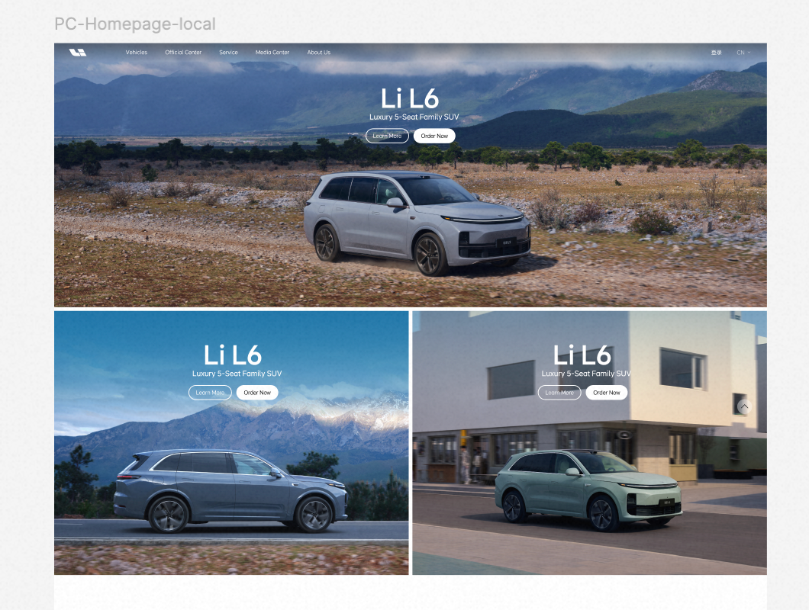
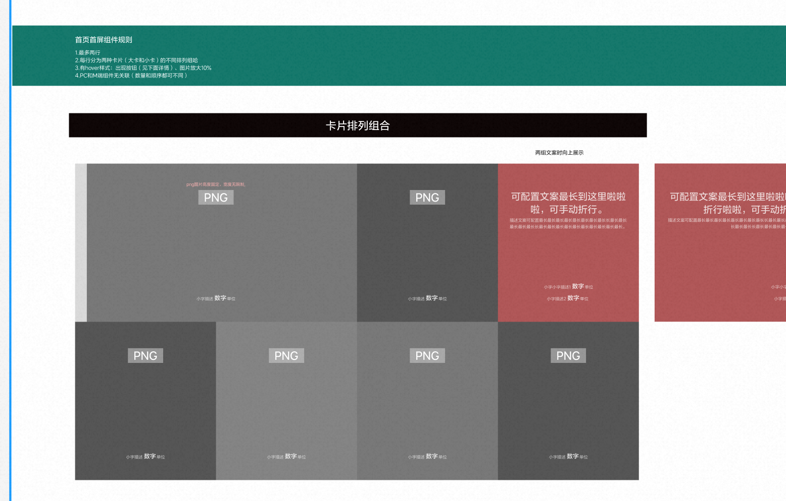
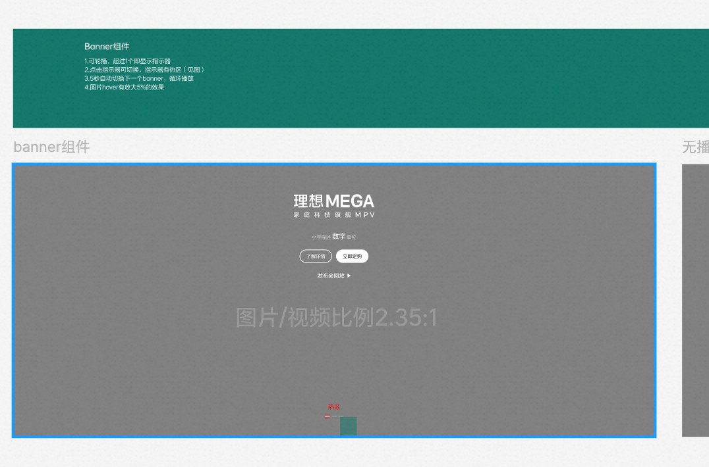
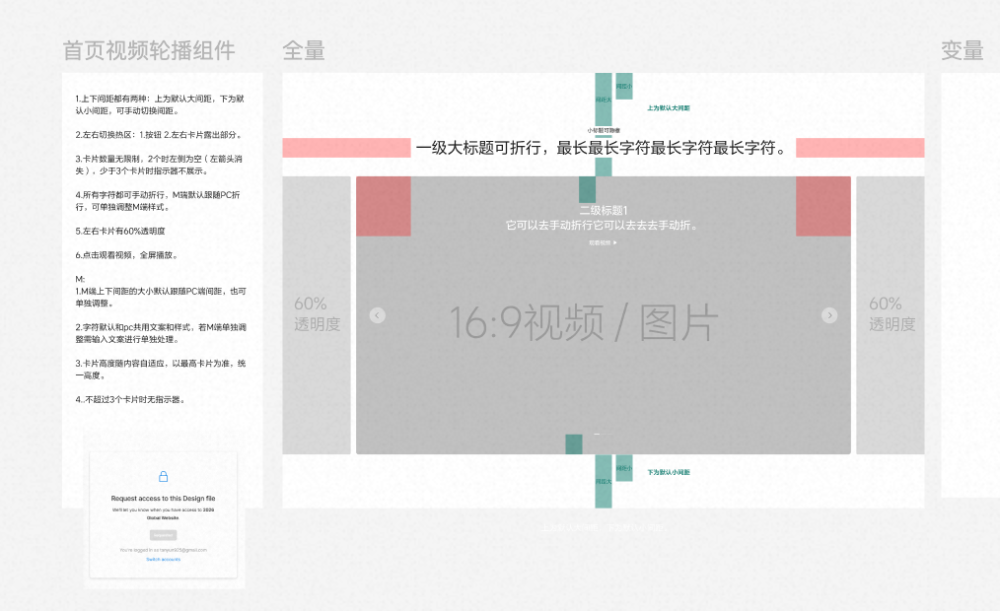
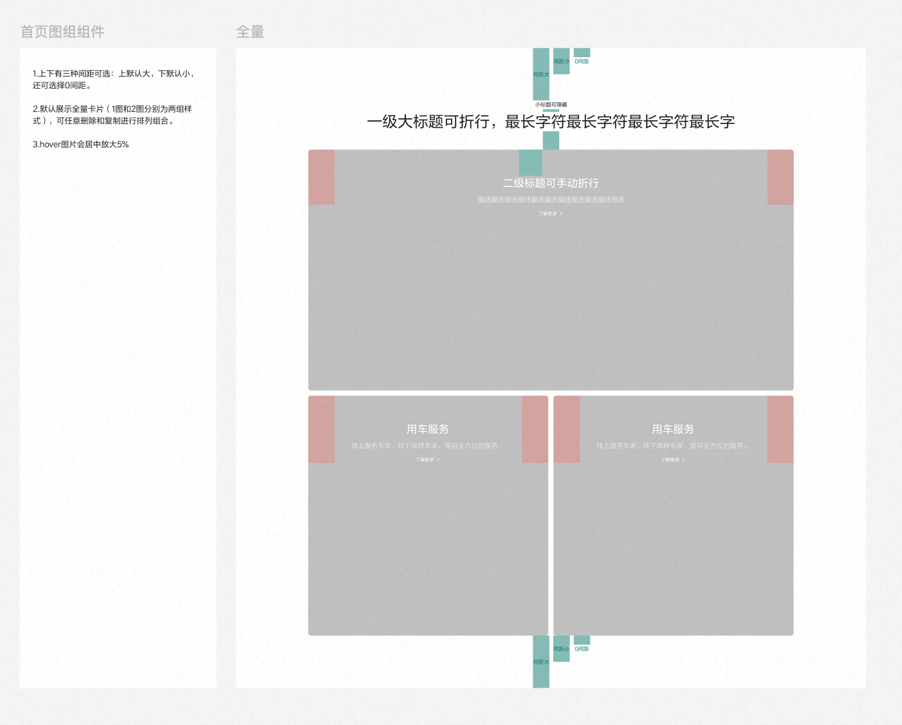

# 首页组件 · 使用与配置手册

> 依据 [`官网组件清单.md`](./官网组件清单.md)（客户建议拆分）编写，覆盖**首页 5 个组件**。
> 字段以 `Universal-editor-demo/component-models.json` 的**真实模型**为准；交互规则综合客户截图批注 + 各 block 实现注释。
> 面向对象：Universal Editor 内容作者 + 前端开发。

## 阅读约定

- **UE 层级**：EDS 组件多为「容器 block + 可增删的子项 item」两层结构；作者在 Universal Editor 里先插入容器，再往容器内加子项。
- **字段类型**：`text` 单行文本 · `richtext` 富文本 · `reference` 图片引用 · `aem-content` 链接（可选内部页面/外链）· `select` 单选 · `multiselect` 多选 · `boolean` 开关。
- **必填标记**：⭐ = 建议必填（缺失会导致渲染异常或空占位）。
- **优先级**：来自客户清单（P0 最高）。

---

## 1. Banner（主视觉 Banner）

**优先级 P0** · 对应 block：`home-banner` → 子项 `banner-slide`

### 用途
首页首屏主视觉。全宽大图/视频承载当前主推车型，可多张轮播。Local 与 Global 站点**首页 Banner 允许不一致**（其余页基本一致）。

### UE 层级与字段

**容器 `home-banner`**

| 字段 | 类型 | Label | 说明 |
| --- | --- | --- | --- |
| id | text | ID | 锚点/统计用，可空 |

**子项 `banner-slide`（每张 = 一屏 Banner，可增删排序）**

| 字段 | 类型 | Label | 说明 |
| --- | --- | --- | --- |
| image ⭐ | reference | Background Image | 背景大图（有视频时作 poster 兜底） |
| imageAlt | text | Image Alt Text | 无障碍替代文本 |
| logo | reference | Vehicle Logo | 车型白色字标（转曲矢量）。**填了 logo 就显示字标，否则回退显示 title + subtitle** |
| title | text | Title | 车型名，如 `Li L6`（无 logo 时展示） |
| subtitle | text | Subtitle | 定位文案，如 `Luxury 5-Seat Family SUV` |
| link | aem-content | Link | CTA 跳转目标 |
| linkText | text | CTA Text | CTA 文案，默认 `Learn More` |

### 交互与响应式
- 全宽；PC 高度 `42.55vw`，移动端 `aspect-ratio 2/3`（竖图）。
- 多张时**无限循环**（首尾克隆），**5s 自动轮播**，底部圆点指示器可点切换。
- hover 暂停自动轮播；激活 slide 图片 hover **放大 5%**。

### ⚠️ 已知差距（需确认）
- 客户截图首屏含**两个按钮**（`Learn More` + `Order Now`），当前 `banner-slide` 模型**只有 1 个 CTA 字段**、实现只渲染 1 个按钮。若需双按钮，需扩展模型（加 `secondaryLink`/`secondaryLinkText`）与 `home-banner.js` 渲染逻辑。
- 截图另含全宽 + 左右分屏两种布局，当前实现为全宽轮播；分屏样式若要保留需加 variant。

### 作者操作
1. 插入 `Home Banner` 容器 → 逐张添加 `Banner Slide`。
2. 每张设背景图 + Alt；主推车型上传 Logo 字标（**不要用普通字体重拼车型名**，用导出的矢量素材）。
3. 设 CTA 文案与链接。多张即自动轮播。

---

## 2. Global 首屏车型卡片排列

**优先级 P2** · 对应 block：`home-vehicle-grid` → 子项 `vehicle-tile`

### 用途
首屏车型入口网格：大卡/小卡混排，可含充电促销卡。

### UE 层级与字段

**容器 `home-vehicle-grid`**

| 字段 | 类型 | Label | 选项 / 说明 |
| --- | --- | --- | --- |
| classes | multiselect | Options | 响应式/样式开关（最多选）：`hide-large-mobile`（移动端隐藏大卡）、`light-cards`（浅色卡片图） |
| id | text | ID | 可空 |

**子项 `vehicle-tile`（每张车型卡/充电卡，可增删排序）**

| 字段 | 类型 | Label | 选项 / 说明 |
| --- | --- | --- | --- |
| image ⭐ | reference | Background Image | PC 背景图 |
| imageAlt | text | Image Alt Text | — |
| mobileImage | reference | Mobile Background Image | 移动端单独背景图（可选，PC/M 可不同） |
| mobileImageAlt | text | Mobile Image Alt Text | — |
| logo | reference | Vehicle Logo | 车型字标 |
| vehicleName | text | Vehicle Name | 车型名 |
| subtitle | text | Subtitle | 定位/价格文案 |
| size ⭐ | select | Card Size | `small`（小卡 480×540）/ `large`（大卡 960×540，跨 2 列） |
| kind | select | Tile Kind | `vehicle`（车型卡）/ `charging`（充电促销卡） |
| link | aem-content | Link | 卡片跳转 |

### 交互与响应式（客户规则）
- **最多两行**，PC 首屏共约 7 张；每行由大卡 + 小卡不同排列组合。
- **hover**：图片放大约 **10%** + 黑色遮罩渐显 + 副标题上移 + 按钮（Learn More / Order Now）显现。
- **PC 与 M 端组件无关联**（数量、顺序均可不同）——用 `mobileImage` + `hide-large-mobile` 独立控制移动端。
- 尺寸参考：PC 大卡 `960×540`、小卡 `480×540`；M 端首张高卡约 `375×563`、后续短卡约 `375×211`。
- 车型不足 6 个时可省略该屏，用满屏组件承接。

### 作者操作
1. 插入 `Home Vehicle Grid` → 逐张添加 `Vehicle Tile`。
2. 用 `size` 控制大/小卡，组合排列；首张通常设 `large`。
3. 充电促销卡把 `kind` 设为 `charging`。
4. 需移动端换图时填 `mobileImage`；需 M 端隐藏大卡时在容器 `classes` 勾 `hide-large-mobile`。

---

## 3. 轮播 Banner

**优先级 P1** · 对应 block：`highlight-carousel` → 子项 `highlight-slide`

### 用途
带**数据指标 + 多 CTA** 的全宽轮播 Banner（如「理想 MEGA / 家庭科技旗舰 MPV / 数字·单位 / 了解详情·立即定购 / 发布会回放」）。比 §1 的主视觉更「富信息」。

### UE 层级与字段

**容器 `highlight-carousel`**

| 字段 | 类型 | Label | 选项 / 说明 |
| --- | --- | --- | --- |
| title | text | Title | 区块标题（PC） |
| mobileTitle | text | Mobile Title Override | 移动端标题覆盖（可空则跟随 PC） |
| description | richtext | Description | 区块描述 |
| autoPlay | boolean | Desktop Autoplay | 桌面自动轮播开关 |
| interval | number | Autoplay Interval (seconds) | 自动切换间隔秒数（客户默认 **5s**） |
| showProgress | boolean | Show Progress | 显示进度/指示器（客户规则：**超过 1 个即显示**） |
| classes | multiselect | Style | 主题 `light`/`dark`/`gray` + 间距 `space-large`/`space-small`/`space-none`（最多选 2） |
| id | text | ID | 可空 |

**子项 `highlight-slide`（每屏 Banner，可增删排序）**

| 字段 | 类型 | Label | 说明 |
| --- | --- | --- | --- |
| image ⭐ | reference | Desktop Poster / Image | PC 图/视频海报（比例参考 **2.35:1**） |
| imageAlt | text | Desktop Image Alt Text | — |
| mobileImage | reference | Mobile Poster / Image | M 端图（可选） |
| mobileImageAlt | text | Mobile Image Alt Text | — |
| video | aem-content | Desktop Video URL | PC 视频（可选，自动播放） |
| mobileVideo | aem-content | Mobile Video URL | M 端视频（可选） |
| eyebrow | text | Eyebrow | 小标题 |
| title | text | Card Title | 主标题（如车型名） |
| description | richtext | Card Description | 副文案 |
| note | text | Note | 小字描述 |
| metricValue | text | Metric Value | 数字（如续航/参数值） |
| metricUnit | text | Metric Unit | 单位 |
| metricLabel | text | Metric Label | 指标说明 |
| link | aem-content | Link | CTA/链接目标 |
| linkText | text | Link Text | CTA 文案 |
| linkType | select | Link Type | `primary`（实心，如「立即定购」）/ `secondary`（线框，如「了解详情」）/ `text`（文字链，如「发布会回放 ▶」） |

> 每屏支持一条 `link`。截图中「了解详情 + 立即定购 + 发布会回放」为三种 `linkType` 的组合展示；如需**单屏多按钮**，需确认是否扩展为多 link 子项。

### 交互与响应式（客户规则）
- 可轮播；**超过 1 个即显示指示器**，指示器**有热区**（点击切换）。
- **5s 自动切换**下一个，循环播放（`autoPlay` + `interval`）。
- 图片 hover **放大 5%**。
- 图片/视频比例 **2.35:1**（超宽全屏）。

### 作者操作
1. 插入 `Highlight Carousel` → 设 `autoPlay` 开、`interval=5`、`showProgress` 开。
2. 逐屏添加 `Highlight Slide`：上传 2.35:1 海报/视频，填标题、数字·单位·小字，设 CTA 及其 `linkType`。
3. 主题/间距在容器 `classes` 选（默认深色底可选 `dark`）。

---

## 4. 首页轮播（视频横滑）

**优先级 P1** · 对应 block：`home-carousel` → 子项 `carousel-card`

### 用途
品牌故事 / 技术点的横滑 coverflow：居中卡片全宽、左右相邻卡片 60% 透明外露，卡片内可放**自动播放视频**。

### UE 层级与字段

**容器 `home-carousel`**

| 字段 | 类型 | Label | 选项 / 说明 |
| --- | --- | --- | --- |
| eyebrow | text | Eyebrow | 小标题 |
| heading | text | Heading | 一级大标题（可折行） |
| mobileHeading | text | Mobile Heading | 移动端标题（可空则跟随 PC） |
| classes | select | Variant | `story`（默认，视频卡 + action，白字压图）/ `tech`（图片卡 + eyebrow） |
| id | text | ID | 可空 |

**子项 `carousel-card`（每张卡，可增删排序）**

| 字段 | 类型 | Label | 说明 |
| --- | --- | --- | --- |
| image ⭐ | reference | Poster / Background Image | 卡片海报/背景（视频的兜底 poster） |
| imageAlt | text | Image Alt Text | — |
| video | aem-content | Video (optional) | 视频链接（`.mp4`）。**仅居中卡片自动播放**，结束显示 Replay |
| title | text | Card Title | 卡片标题 |
| actionLabel | text | Action Text (optional) | 如「观看完整影片」 |
| link | aem-content | Link (optional) | 跳转目标 |

### 交互与响应式（客户规则）
- **居中卡全宽**，左右相邻卡 **60% 透明**并向两侧偏移。
- 切换热区：**箭头** + **左右露出的卡片**；`story` 视频卡仅居中自动播放。
- 卡片数量无限；**少于 3 张不显示指示器**；2 张时左倒为空（箭头消失）。
- 上下间距有大/小两种可切换。
- 所有文字可手动折行，M 端默认跟随 PC，可单独调 `mobileHeading`。
- 卡片高度随内容自适应，按最高卡统一。
- 客户规则「点击观看视频、全屏播放」：当前实现为中央卡自动播放 + Replay，**全屏播放行为需确认/补实现**。

### 作者操作
1. 插入 `Home Carousel` → 选 `story`（含视频）或 `tech`（纯图）。
2. 填 eyebrow + 大标题；逐张加 `Carousel Card`（poster 必填、视频可选、action 文案可选）。
3. ≥3 张才出指示器，注意卡片数量规则。

---

## 5. 首页图组

**优先级 P1** · 对应 block：`picture-group` → 子项 `picture-group-item` → 孙项 `picture-media-item`

### 用途
带区块大标题的图/视频组：默认展示「1 图样式 + 2 图样式」两组，可任意增删复制卡片做排列组合。

### UE 层级与字段（三层）

**容器 `picture-group`**

| 字段 | 类型 | Label | 选项 / 说明 |
| --- | --- | --- | --- |
| eyebrow | text | Eyebrow | 小标题（**可隐藏**：留空即不显示） |
| title | text | Desktop Title | 一级大标题（可折行） |
| mobileTitle | text | Mobile Title Override | M 端标题覆盖 |
| description | richtext | Description | 区块描述 |
| showVideoControl | boolean | Show Video Controls | 显示视频控件 |
| showProgress | boolean | Show Video Progress | 显示视频进度 |
| enableMotion | boolean | Enable Parallax Motion | 视差动效开关 |
| classes | multiselect | Style | 主题 `light`/`dark`/`gray` + 间距 `space-large`/`space-small`/`space-none`（最多选 2） |
| id | text | ID | 可空 |

**子项 `picture-group-item`（一个「组」= 一种排列样式，可增删复制）**

| 字段 | 类型 | Label | 说明 |
| --- | --- | --- | --- |
| groupKey | text | Group Key | 组标识（区分 1 图/2 图样式等排列） |
| title | text | Desktop Group Title | 二级标题（可手动折行） |
| mobileTitle | text | Mobile Group Title | M 端组标题 |
| description | richtext | Group Description | 组描述 |

**孙项 `picture-media-item`（组内每张图/视频卡）**

| 字段 | 类型 | Label | 说明 |
| --- | --- | --- | --- |
| image ⭐ | reference | Desktop Poster / Image | PC 图/视频海报 |
| imageAlt | text | Desktop Image Alt Text | — |
| mobileImage | reference | Mobile Poster / Image | M 端图（可选） |
| mobileImageAlt | text | Mobile Image Alt Text | — |
| video | aem-content | Desktop Video URL | PC 视频（可选） |
| mobileVideo | aem-content | Mobile Video URL | M 端视频（可选） |
| title | text | Media Title | 卡片标题 |
| description | richtext | Media Description | 卡片描述 |
| note | text | Note | 小字 |

### 交互与响应式（客户规则）
- 上下间距**三种可选**：上默认大、下默认小，还可选 **0 间距**（用容器 `classes` 的 `space-large`/`space-small`/`space-none`）。
- 默认展示全量卡片（1 图、2 图两组样式），可任意删除/复制做排列组合。
- hover 图片**居中放大 5%**。
- 视频控件/进度/视差由容器三个 boolean 开关控制。

### 作者操作
1. 插入 `Picture Group` → 填大标题（eyebrow 留空即隐藏小标题），选主题 + 间距。
2. 加 `Picture Group Item` 作为「组」（1 图样式一组、2 图样式一组…），填二级标题/描述。
3. 每组内加 `Picture Media Item`（图或视频卡）；需 M 端换图/换视频时填 mobile 字段。

---

## 附：首页 5 组件速查

| 客户组件 | block（容器→子项） | 变体 variant | 关键交互 |
| --- | --- | --- | --- |
| Banner | `home-banner → banner-slide` | 无（logo 有无自动切换展示） | 全宽 5s 轮播、hover 放大 5% |
| Global 首屏车型卡片排列 | `home-vehicle-grid → vehicle-tile` | `hide-large-mobile`、`light-cards`；卡 `size`/`kind` | hover 放大 10% + 遮罩 + 出按钮 |
| 轮播 Banner | `highlight-carousel → highlight-slide` | 主题×间距；卡 `linkType` | 2.35:1、5s 自动、指示器热区 |
| 首页轮播 | `home-carousel → carousel-card` | `story`/`tech` | coverflow 60% 透明、中央卡视频自动播、≥3 出指示器 |
| 首页图组 | `picture-group → picture-group-item → picture-media-item` | 主题×间距（含 0 间距） | hover 放大 5%、可视差 |

### 待确认清单（写码前需对齐）
1. **Banner 双按钮**（Learn More + Order Now）：现模型/实现仅 1 CTA，是否扩展。
2. **轮播 Banner 单屏多按钮**：现每屏 1 link，截图为 3 种 linkType 组合，是否需要单屏多 CTA。
3. **首页轮播「全屏播放」**：现为中央卡自动播 + Replay，全屏点击行为待补。
4. **验证方式**：本仓库无自动化测试，改后靠 `aem up` + 三断点（1440/1920 · 1024 · 390px）手工验证，无横向溢出、0 console 错误。
