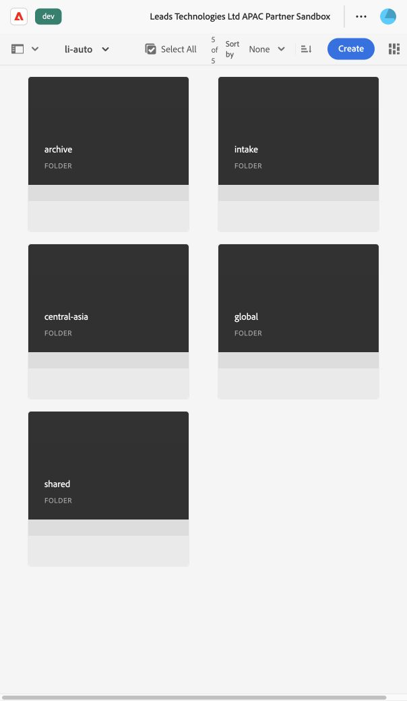
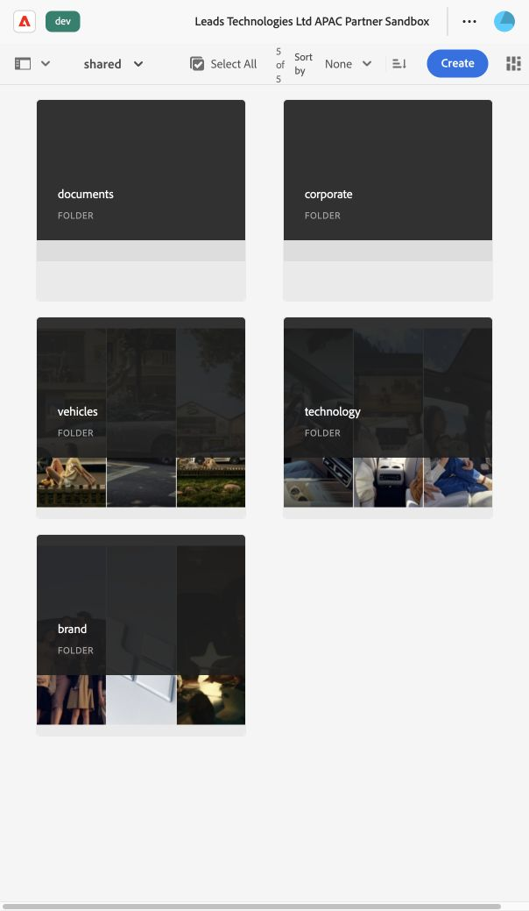
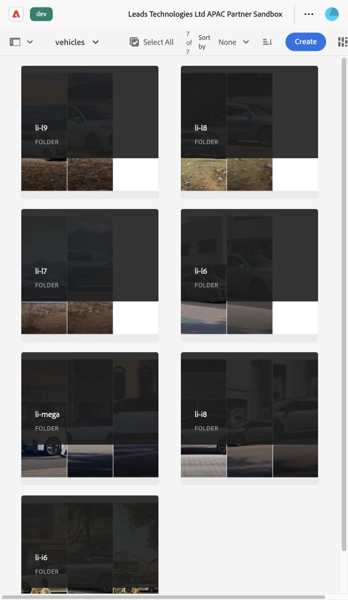
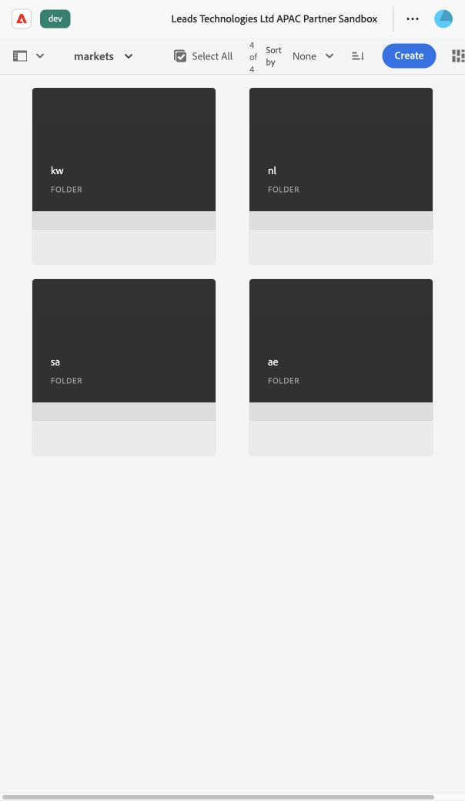
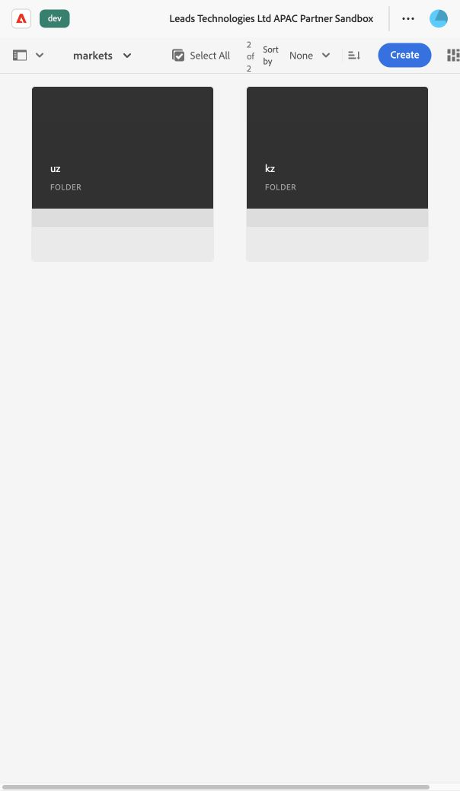
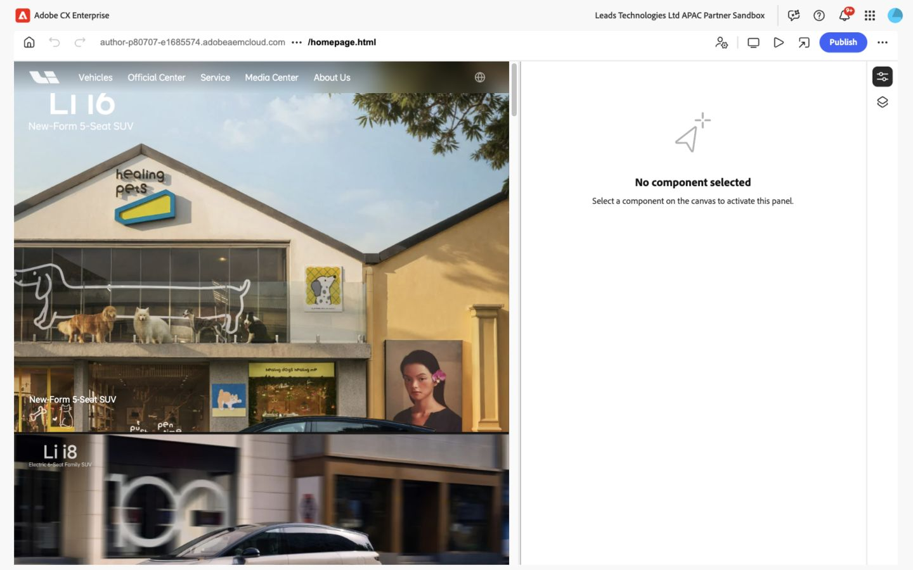

# 理想汽车海外官网 AEM EDS DAM 架构设计与使用指南

| 文档属性 | 内容 |
| --- | --- |
| 文档版本 | V1.0 |
| 文档状态 | 已实施、已验证 |
| 日期 | 2026-07-20 |
| 适用环境 | leadstec-dev |
| AEM Author | `author-p80707-e1685574.adobeaemcloud.com` |
| 适用范围 | 理想汽车海外官网 AEM EDS 数字资产架构、作者使用、发布和运维 |

> 本文档是《理想汽车海外官网 AEM EDS 系统架构设计文档 V0.1》中“数字资产管理”设计的实施级补充。本文记录已经在 `leadstec-dev` 落地并验证的 DAM 结构和 Homepage 迁移结果。独立权限用户、最终 ACL 组、自动审批工作流及 Dynamic Media 专项配置不在本版本范围内。

## 目录

1. 文档目的与范围
2. 设计背景和原则
3. 总体架构与边界
4. DAM 目录结构设计
5. 资产放置、命名和元数据规范
6. AEM EDS 资产交付设计
7. Homepage 迁移实施说明
8. 内容作者使用指南
9. 新市场和新语言扩展指南
10. 发布、验证和验收
11. 故障处理与回滚
12. 权限与治理建议
13. 附录

## 1. 文档目的与范围

### 1.1 文档目的

本文档用于统一理想汽车海外官网数字资产的目录结构、治理边界、命名、元数据、AEM Author 使用、Universal Editor 引用、EDS 发布、验证和回滚方式，使内容作者、开发人员和运维人员使用同一套规则。

### 1.2 适用对象

- AEM Assets 内容作者和资产管理员；
- Universal Editor 页面作者；
- AEM EDS 前端开发人员；
- 内容迁移、测试、发布和运维人员；
- 后续负责市场权限、Metadata Profile 和审批流程设计的项目成员。

### 1.3 本版本包含

- `/content/dam/li-auto` 的正式目录架构；
- Global 与 Central Asia 的并列资产治理边界；
- 共享、市场、语言、接收区和归档区的使用规则；
- 图片、视频和文档的命名与元数据规范；
- AEM DAM 到 EDS `/assets/` 的交付路径；
- Homepage 41 个数字资产、43 个页面属性的迁移结果；
- 作者上传、处理、引用、发布、验证和替换资产的操作方式；
- 新国家和新语言扩展时的路径设计方法；
- 常见问题、验收清单和回滚方式。

### 1.4 本版本不包含

- 最终 IMS/AEM 用户组名称和逐项 ACL；
- 自动审批、翻译、保留和销毁工作流；
- Dynamic Media、Smart Crop、Scene7 URL 或 DM Profile 的专项配置；
- 产品页、法律文档、Header、Footer 的完整资产迁移；
- Stage、Prod 环境的实际资产同步和上线计划。

## 2. 设计背景和原则

### 2.1 背景

原 Homepage 资产分散在 `/content/dam/li-demo` 的组件型目录中，存在文件名不透明、治理边界不清晰、页面用途与市场归属混合、后续权限难以继承等问题。项目需要建立可长期扩展的正式 DAM 根路径，同时支撑 Global、UAE、SA、NL、KW、KZ、UZ 的多市场和多语言运营。

### 2.2 核心设计原则

1. **Global 与 Central Asia 并列治理。** Global 管理 Global English、UAE、SA、NL、KW；Central Asia 管理 KZ、UZ，两者不形成上下级继承关系。
2. **语言无关资产只存一份。** 车型图、品牌故事、技术图片等通用素材优先放在 `shared`，不得因为页面、国家或语言重复复制。
3. **只有真实差异才进入市场和语言目录。** 法规、活动、价格、当地门店、当地文案图片等市场或语言专属素材才进入对应目录。
4. **目录用于治理，元数据用于检索。** 所有权、市场和语言使用稳定目录表达；素材角色、页面用途和活动标签通过元数据表达，避免无限增加目录层级。
5. **页面内容、代码和资产分离。** AEM Sites 管理页面结构和内容；Git 仓库管理 Block 和模型；AEM Assets 管理二进制文件。
6. **先处理、再引用、后发布。** 新资产必须完成 AEM Assets Full Process 并验证可读取，才能切换页面引用。
7. **可回滚。** 迁移期间保留旧 DAM 树和完整旧值映射，不以删除旧资产作为迁移完成条件。
8. **不在页面中保存手工 DM URL。** 页面字段只保存 `/content/dam/li-auto/...` 的标准 AEM DAM 引用。

## 3. 总体架构与边界

### 3.1 三类路径必须区分

| 路径类型 | 示例 | 作用 | 谁维护 |
| --- | --- | --- | --- |
| AEM Sites 内容路径 | `/content/demo-site/language-master/en/homepage` | 页面、Header、Footer、组件和语言内容 | 页面作者 |
| AEM DAM 资产路径 | `/content/dam/li-auto/shared/...` | 图片、视频、PDF 等二进制及元数据 | 资产作者 |
| EDS 公共交付路径 | `/assets/shared/...` 或 `media_<hash>` | Preview/Live 对终端浏览器提供资产 | EDS 自动生成 |

不得把 Sites 内容页面放入 DAM，也不得把图片、视频等二进制作为页面节点维护。

### 3.2 页面内容结构和 DAM 结构互不替代

- Homepage：`/content/demo-site/language-master/en/homepage`
- Header：`/content/demo-site/language-master/en/nav`
- Footer：`/content/demo-site/language-master/en/footer`
- 以上是 AEM Sites 内容节点，不属于 DAM。
- `/site/nav` 属于旧实现，不作为当前正式 Header 内容来源。
- Header、Footer 如果引用 Logo、图标或其他媒体，媒体仍按本文的 `shared` 或市场专属规则放入 DAM。

### 3.3 资产数据流

```text
权威来源/新素材
  → 校验文件、版权、MIME 和重复项
  → 上传至 intake 或目标治理目录
  → 补齐元数据
  → AEM Assets Full Process
  → 确认 dam:assetState=processed
  → Universal Editor 使用 reference 字段引用
  → Quick Publish 页面及引用资产
  → EDS Preview / Author 响应式验证
```

### 3.4 责任边界

| 领域 | 主要职责 |
| --- | --- |
| AEM Assets | 上传、处理、元数据、目录治理、查找、替换和归档资产 |
| Universal Editor | 在页面组件字段中选择标准 DAM 引用 |
| AEM Sites | 页面结构、语言页面、Header/Footer、版本和内容发布 |
| EDS 配置 | 将允许的 AEM 内容和 DAM 路径映射到公共站点路径 |
| Block 代码 | 将语义 HTML 装饰为最终交互和响应式页面 |

## 4. DAM 目录结构设计

### 4.1 正式根目录

所有新治理资产统一位于：

```text
/content/dam/li-auto
```

环境名称不得写入资产路径。Dev、Stage、Prod 应使用相同逻辑路径，依靠环境本身区分内容。

### 4.2 治理目录树

```text
/content/dam/li-auto
├── shared
│   ├── brand
│   │   └── homepage
│   │       ├── stories
│   │       └── lifestyle
│   ├── vehicles
│   │   ├── li-i6/homepage
│   │   ├── li-i8/homepage
│   │   ├── li-mega/homepage
│   │   ├── li-l6/homepage
│   │   ├── li-l7/homepage
│   │   ├── li-l8/homepage
│   │   └── li-l9/homepage
│   ├── technology/homepage
│   ├── corporate
│   └── documents
├── global
│   ├── site/en/{media,documents}
│   └── markets
│       ├── ae/{en,ar}/{media,documents}
│       ├── sa/ar/{media,documents}
│       ├── nl/nl/{media,documents}
│       └── kw/en/{media,documents}
├── central-asia
│   └── markets
│       ├── kz/{kk,ru}/{media,documents}
│       └── uz/{uz,ru}/{media,documents}
├── intake
│   ├── global
│   └── central-asia
└── archive
    ├── shared
    ├── global
    └── central-asia
```

当前 `leadstec-dev` 已创建 72 个 `sling:Folder` 后代节点。



*图 3　AEM Assets 中已落地的 `/content/dam/li-auto` 根目录。五个顶层目录与治理设计一致。*

### 4.3 顶层目录职责

| 目录 | 适用内容 | 禁止内容 |
| --- | --- | --- |
| `shared` | 跨市场、跨语言复用的品牌、车型、技术和企业资产 | 只适用于单一国家的法规、价格和活动素材 |
| `global/site` | Global 站点自身专属的语言资产 | UAE、SA、NL、KW 的市场专属资产 |
| `global/markets` | Global 管理范围内的市场/语言专属资产 | KZ、UZ 专属资产 |
| `central-asia/markets` | KZ、UZ 的市场/语言专属资产 | Global、UAE、SA、NL、KW 专属资产 |
| `intake` | 待校验、待补元数据、待审批的临时上传内容 | 页面长期引用的正式资产 |
| `archive` | 已退役但仍需保留、追溯或回滚的资产 | 新资产和仍在使用的正式资产 |



*图 4　`shared` 下的品牌、车型、技术、企业和文档资产边界。卡片缩略图来自已完成处理的实际资产。*



*图 5　`shared/vehicles` 下已建立的车型目录，Homepage 车型资产按产品代码归档。*

### 4.4 市场与语言矩阵

| 治理域 | 市场 | 市场代码 | 语言 | 语言代码 | 目录示例 |
| --- | --- | --- | --- | --- | --- |
| Global | Global | site | English | en | `/global/site/en/media` |
| Global | UAE | ae | English / Arabic | en / ar | `/global/markets/ae/en/media` |
| Global | Saudi Arabia | sa | Arabic | ar | `/global/markets/sa/ar/media` |
| Global | Netherlands | nl | Dutch | nl | `/global/markets/nl/nl/media` |
| Global | Kuwait | kw | English | en | `/global/markets/kw/en/media` |
| Central Asia | Kazakhstan | kz | Kazakh / Russian | kk / ru | `/central-asia/markets/kz/kk/media` |
| Central Asia | Uzbekistan | uz | Uzbek / Russian | uz / ru | `/central-asia/markets/uz/uz/media` |



*图 6　Global 治理域当前包含 UAE、Saudi Arabia、Netherlands 和 Kuwait 市场目录。*



*图 7　Central Asia 治理域中的 Kazakhstan 与 Uzbekistan 市场目录，与 Global 并列治理。*

### 4.5 资产应放在哪里

按以下顺序判断：

1. 素材是否能跨国家、跨语言复用？如果是，放入 `shared`。
2. 素材是否只属于一个治理域但不属于单一市场？如果是，放入该治理域的 `site/<language>`。
3. 素材是否只属于一个国家？如果是，进入 `markets/<country>/<language>`。
4. 素材是否仍待确认？如果是，先进入 `intake/<governance-domain>`。
5. 素材是否已经停用但仍需追溯？如果是，移动至相应 `archive`。

不得仅因为同一张图片在多个页面中使用，就为每个页面或语言复制一份二进制。

## 5. 资产放置、命名和元数据规范

### 5.1 Homepage 资产放置

| 资产类别 | 正式路径 |
| --- | --- |
| 车型卡片、Hero、车型 Logo | `/shared/vehicles/<model>/homepage` |
| 品牌故事海报和视频 | `/shared/brand/homepage/stories` |
| 品牌生活方式图片 | `/shared/brand/homepage/lifestyle` |
| 技术卡片图片 | `/shared/technology/homepage` |

### 5.2 文件命名

- 使用小写 ASCII 和 kebab-case，例如 `li-i6-homepage-hero-desktop.jpg`。
- 保留正确扩展名，不把 JPEG 伪装为 PNG，也不随意改扩展名。
- 只有真实存在不同文件时才使用 `desktop`、`mobile` 等设备后缀。
- 使用可读的业务语义，不直接把来源 UUID 作为文件名。
- 车型名称统一使用正式产品代码，例如 `li-i6`、`li-mega`。
- 视频海报建议使用与视频一致的主体名称，并增加 `-poster`，例如：
  - `story-private-space.mp4`
  - `story-private-space-poster.jpg`

### 5.3 必备元数据

| 元数据 | 要求 | 示例 |
| --- | --- | --- |
| `dc:title` | 必填；对作者可读的标题 | `Li i6 Homepage Hero Desktop` |
| `dc:description` | 必填；说明用途和来源 | `Shared vehicle Homepage asset...` |
| `dc:language` | 必填；语言无关素材使用 `und` | `und` |
| `dc:source` | 迁移资产必填；保存权威来源 URL | `https://lilibrary-public...` |
| `xmpRights:UsageTerms` | 权利信息明确后填写 | 使用范围、期限或合同编号 |

不应仅依赖文件名判断版权和来源。来源 URL、权利说明和负责人应进入元数据或迁移记录。

### 5.4 替换和版本策略

- 内容没有变化但二进制需要更新时，优先使用同一资产路径的新版本，避免批量修改页面引用。
- 业务含义或用途发生变化时创建新文件名，不要用同路径覆盖完全不同的素材。
- 替换后必须重新执行处理、发布和 Preview 验证。
- 旧资产在确认无引用前不得直接删除；需要回滚时移动到 `archive` 或保留原目录。

## 6. AEM EDS 资产交付设计

### 6.1 路径映射

项目 `paths.json` 已配置：

```json
{
  "mappings": [
    "/content/demo-site/:/",
    "/content/dam/li-auto/:/assets/"
  ],
  "includes": [
    "/content/demo-site/",
    "/content/dam/li-auto/"
  ]
}
```

该配置同时完成两件事：

1. 将 AEM DAM 内部路径映射为站点公共 `/assets/` 路径；
2. 明确允许 `/content/dam/li-auto/` 进入 EDS 发布范围。

### 6.2 图片交付

- 页面字段保存 `/content/dam/li-auto/...` 引用。
- AEM 向 EDS 输出语义 HTML。
- EDS 对页面图片生成适合浏览器和展示尺寸的优化媒体 URL。
- 作者不需要、也不应该手工填写最终的 `media_<hash>` URL。

### 6.3 视频交付

- Universal Editor 视频字段必须使用 AEM Assets `reference`。
- 页面内容保存 `/content/dam/li-auto/.../*.mp4`。
- EDS 语义 HTML 输出 `/assets/.../*.mp4` 的可读路径。
- 该可读路径重定向到同源、不可变的 `media_<hash>.mp4`。
- 当前 Homepage 三个视频最终均返回 HTTP 200 和 `content-type: video/mp4`。

### 6.4 Dynamic Media 边界

- 本方案不要求作者配置 Dynamic Media、Smart Crop、Scene7 URL 或 DM Profile。
- 页面属性中不得保存 `/adobe/dynamicmedia/...` 或 Scene7 交付 URL。
- AEM Cloud 环境可能在标准资产处理过程中生成内部处理元数据或临时 Author 展示地址；这些不是页面内容契约，也不得复制到组件字段。
- 如果未来资产超过 EDS 支持范围，应压缩源文件或生成 `edge-delivery-services-<subtype>` rendition，而不是绕过治理规则填入临时 URL。

### 6.5 官方依据

- Adobe AEM Assets 发布说明：<https://www.aem.live/docs/universal-editor-assets>
- AEM Authoring 路径映射：<https://www.aem.live/developer/authoring-path-mapping>
- EDS Media Assets：<https://www.aem.live/docs/media>

## 7. Homepage 迁移实施说明

### 7.1 页面和来源

| 项目 | 值 |
| --- | --- |
| AEM 页面 | `/content/demo-site/language-master/en/homepage` |
| 组件根 | `/content/demo-site/language-master/en/homepage/jcr:content/root/section` |
| 权威素材来源 | `lixiang2/eds-reference/assets/data/site-data.js` 的 `home.blocks` |
| 旧 DAM 根 | `/content/dam/li-demo` |
| 新 DAM 根 | `/content/dam/li-auto` |

### 7.2 迁移范围

Homepage 当前有 43 个资产属性，解析为 41 个唯一二进制：

| 类别 | 唯一资产数 | 页面属性数 |
| --- | ---: | ---: |
| 车型卡片、Hero、Logo | 25 | 27 |
| 品牌故事和生活方式 | 8 | 8 |
| 技术图片 | 8 | 8 |
| 合计 | 41 | 43 |

属性类型验证结果：

- `image`：23/23 已指向 `/content/dam/li-auto/`；
- `mobileImage`：7/7 已指向 `/content/dam/li-auto/`；
- `logo`：10/10 已指向 `/content/dam/li-auto/`；
- `video`：3/3 已指向 `/content/dam/li-auto/`；
- 上述属性均不再包含 `/content/dam/li-demo/`。

### 7.3 未迁移内容

`eds-reference` 中还有移动端 Logo、充电图片等素材，但当前 Homepage 内容模型没有对应消费字段，因此未上传。这一决定避免创建无人使用、无页面契约的资产。

### 7.4 Banner 强制规则

Homepage `home-banner` 在桌面、平板和移动端都必须显示。以下情况均属于缺陷：

- 整个 Banner 被媒体查询隐藏；
- Banner 未渲染或高度为 0；
- 图片加载失败，只显示灰色背景或破图；
- AEM Author 正常但 EDS Preview 消失，或反之。

任何 Homepage、Banner、全局响应式样式和内容模型变更，至少必须在 1920px 与 390px 验证 Banner 可见。

### 7.5 迁移证据和回滚清单

- 完整 43 条旧值到新值映射：`openspec/changes/add-dam-governance-structure/migration-manifest.md`
- 实施设计：`openspec/changes/add-dam-governance-structure/design.md`
- 验证记录：`openspec/changes/add-dam-governance-structure/validation.md`
- 旧 `/content/dam/li-demo` 保持未删除，作为当前回滚来源。

## 8. 内容作者使用指南

### 8.1 上传前准备

上传前确认：

- 已获得合法、可追溯的源文件；
- 文件 MIME 与扩展名一致；
- 图片尺寸与页面用途合理；
- 视频为浏览器支持的 MP4，并准备 Poster；
- 已判断素材属于 `shared`、具体市场/语言，还是 `intake`；
- DAM 中不存在同一二进制或同一业务用途的重复资产。

### 8.2 上传资产

1. 在 AEM 首页进入 **Assets → Files**。
2. 打开 `/content/dam/li-auto` 下正确的治理目录。
3. 未确认素材先上传至 `intake/global` 或 `intake/central-asia`。
4. 已确认的迁移批次或正式素材可上传到最终目标目录。
5. 上传后打开 Properties，填写标题、描述、语言、来源和权利信息。

### 8.3 执行 Full Process

新上传资产必须完成标准处理，否则 Author 可能出现灰底、破图、缩略图缺失或媒体不可用。

1. 在 Assets 控制台选择资产或单一文件夹。
2. 点击 **Reprocess Assets**。
3. 选择 **Full Process**。
4. 点击 **Reprocess**。
5. 等待异步任务完成；批量处理期间不要立即切换页面引用。
6. 验证资产状态为 `dam:assetState=processed`，并确认不存在持续的 `processing` 或 `failed`。

> AEM 的 Reprocess job 一次最多接收一个文件夹。批量处理多个治理目录时应逐个提交，避免误以为所有选中目录都已处理。

### 8.4 在 Universal Editor 中引用图片

1. 打开目标页面和组件。
2. 在图片、移动图片、Logo、Poster 等 `reference` 字段中打开资产选择器。
3. 从 `/content/dam/li-auto` 选择正式资产。
4. 补充 Alt Text；装饰性图片也应按项目无障碍规则处理。
5. 保存后在 Author 画布中确认图片加载，而不是只检查字段值。



*图 8　`language-master/en/homepage` 的 Universal Editor 桌面画布。Homepage Banner 和已迁移图片在 Author 中可见。*

不得把本地文件地址、旧 `/content/dam/li-demo` 路径、`media_<hash>` 或临时 DM URL 粘贴到字段中。

### 8.5 在 Home Carousel 中引用视频

1. 先上传 MP4 和对应 Poster。
2. 两者必须完成 Full Process。
3. Poster 选择 `image` reference。
4. MP4 选择 `video` reference。
5. 填写 `imageAlt`、标题和 Action 文案。
6. 在 Author 中确认视频可以加载，在 EDS Preview 中确认最终响应为 `video/mp4`。

### 8.6 发布资产和页面

推荐顺序：

1. 完成资产处理和 Author 验证；
2. Quick Publish 新增或变更的资产；
3. Quick Publish 页面，确认提示包含页面及其引用；
4. 打开 EDS Preview 并执行强制刷新；
5. 验证页面、图片和视频请求；
6. 完成业务验收后再进入 Live/Prod 发布流程。

被页面引用的资产通常会随页面发布，但直接通过 `/assets/` 使用的 PDF、视频或其他文件仍应确保 DAM 路径位于 `includes`，并按资产发布流程操作。

### 8.7 替换现有资产

1. 确认需要保持原路径还是创建新业务资产。
2. 保持原路径替换时，上传新版本并重新 Full Process。
3. 创建新资产时，在 Universal Editor 中更新对应 reference。
4. 发布资产和页面。
5. 在 Author 和 Preview 验证。
6. 确认旧资产无引用后再归档，不直接删除。

## 9. 新市场和新语言扩展指南

### 9.1 决定治理域

- KZ、UZ 属于 `central-asia`。
- UAE、SA、NL、KW 以及默认新增的非中亚市场属于 `global`。
- 如果未来新增新的区域管理层，必须先进行架构评审，不得直接嵌入现有 Global 或 Central Asia 下形成错误继承。

### 9.2 创建目录

新增市场使用：

```text
/content/dam/li-auto/<governance-domain>/markets/<country-code>/<language-code>/media
/content/dam/li-auto/<governance-domain>/markets/<country-code>/<language-code>/documents
```

例如新增法国法语市场：

```text
/content/dam/li-auto/global/markets/fr/fr/media
/content/dam/li-auto/global/markets/fr/fr/documents
```

### 9.3 扩展步骤

1. 确认 ISO 国家代码和语言代码；
2. 确认由 Global、Central Asia 还是未来新区域治理；
3. 创建市场和语言下的 `media`、`documents`；
4. 继承或配置 Metadata Profile；
5. 在权限方案确认后，对稳定目录授予组权限；
6. 上传并处理专属资产；
7. 创建对应 AEM Sites 市场/语言页面；
8. 配置 Header 的国家/语言切换关系；
9. 发布并验证路由、hreflang、Canonical、资产和响应式页面。

因为当前 EDS mapping 已包含整个 `/content/dam/li-auto/`，在该根目录内新增市场文件夹通常不需要再增加独立 DAM mapping；但仍需验证站点配置、页面路径和实际发布范围。

## 10. 发布、验证和验收

### 10.1 资产验收

- 资产位于正确治理目录；
- 文件名符合 lowercase kebab-case；
- MIME 与扩展名一致；
- 必备元数据完整；
- 有 `renditions/original`；
- `dam:assetState=processed`；
- 图片在 Author 中有非零 natural width/height；
- 视频可加载并且浏览器无媒体错误。

### 10.2 页面验收

- 页面所有资产字段指向 `/content/dam/li-auto/`；
- 不再引用迁移范围内的 `/content/dam/li-demo/`；
- Header 和 Footer 正常出现；
- 不存在 `.block-error`；
- 页面无横向滚动条；
- 控制台无错误；
- Homepage Banner 可见且高度大于 0；
- 三个 Homepage 视频进入 `readyState=4` 或完成等价的可播放验证。

### 10.3 响应式验收断点

| 环境 | 断点 | 必验内容 |
| --- | ---: | --- |
| EDS Preview | 1920 × 1080 | Banner、Header/Footer、图片、视频、无溢出、无 Block 错误 |
| EDS Preview | 390 × 844 | Banner 不消失、移动菜单、图片裁切、无溢出、无 Block 错误 |
| AEM Author | 390 × 844 | 图片和视频真实加载，不出现灰底/破图，编辑结构正常 |

### 10.4 本次实施结果

- 72 个正式 DAM 文件夹；
- 41 个 `dam:Asset`；
- 41/41 资产为 `processed`；
- 41/41 资产 Preview Activate；
- 43/43 Homepage 资产属性切换完成；
- 三个 MP4 通过 `/assets/` 跳转到同源 Media Bus，最终 HTTP 200；
- Preview 1920px、Preview 390px、Author 390px 均通过；
- Homepage Banner 在所有验收视口中可见；
- `npm run build:json`、`npm run lint` 和 OpenSpec strict validation 通过。

## 11. 故障处理与回滚

### 11.1 Author 图片灰底或破图

**典型原因：** 资产上传后只有 original，没有完成 AEM Assets 标准处理和 Web rendition。

**处理方法：**

1. 选择单一正式资产文件夹；
2. Reprocess Assets → Full Process；
3. 等待 `dam:assetState=processed`；
4. 刷新 Author 页面并检查图片自然尺寸；
5. 如仍失败，检查 MIME、原文件和处理任务状态。

### 11.2 Preview 视频返回 404

检查以下项目：

- `paths.json` 是否包含 `/content/dam/li-auto/:/assets/`；
- `includes` 是否包含 `/content/dam/li-auto/`；
- 视频字段是否为 `reference`；
- AEM 页面内容是否保存 `/content/dam/li-auto/...mp4`；
- 资产和页面是否已重新发布；
- `/assets/...mp4` 是否跳转到 `media_*.mp4` 且最终为 200。

### 11.3 Preview 仍显示旧内容

- 确认 AEM 页面保存成功；
- Quick Publish 页面及引用；
- 使用 cache-busting query 或强制刷新；
- 检查语义 HTML 中的实际 href/src；
- 不要只依赖 AEM 全文索引查询结果。

### 11.4 AEM 查询仍返回旧 DAM 路径

QueryBuilder 全文索引可能短期滞后。迁移验收应读取实际组件属性，并分别验证：

- `contains /content/dam/li-auto/`；
- `notContains /content/dam/li-demo/`。

### 11.5 大视频处理或发布失败

- 先确认文件是否超出 EDS 支持限制；
- 优先压缩源文件；
- 必要时通过 AEM Processing Profile 生成 `edge-delivery-services-mp4` rendition；
- 页面中仍保存标准 DAM reference，不填外部临时地址；
- 使用 Poster，避免视频阻塞首屏。

### 11.6 Homepage Banner 消失

Banner 消失属于回归缺陷。检查：

- `home-banner` 是否仍存在于语义 HTML；
- CSS 是否通过移动端媒体查询隐藏整个 block；
- 图片是否完成处理并加载；
- Block 是否产生 `.block-error`；
- Banner 高度是否大于 0；
- Author 与 Preview 是否表现一致。

### 11.7 回滚步骤

1. 停止继续删除或移动新旧资产；
2. 使用 `migration-manifest.md` 将 43 个属性恢复为 `Old value`；
3. 重新发布 Homepage；
4. 在 Author、1920px Preview 和 390px Preview 验证；
5. 记录回滚原因和失败资产；
6. 修复后重新执行完整迁移流程。

本次 Dev 环境无法通过连接账号创建页面版本或导出完整包，因此 `migration-manifest.md` 是当前权威回滚清单。旧 `/content/dam/li-demo` 在另行批准退役前不得删除。

## 12. 权限与治理建议

### 12.1 当前状态

本版本仅建立适合未来 ACL 继承的稳定路径，没有配置最终独立权限用户或用户组。路径结构不等于权限已经生效。

### 12.2 推荐权限模型

后续建议按用户组而不是个人账号授权：

| 建议角色 | 推荐范围 | 典型权限 |
| --- | --- | --- |
| DAM 管理员 | `/content/dam/li-auto` | 管理目录、Metadata Profile、权限和归档 |
| Global 资产编辑 | `/shared`、`/global`、`/intake/global` | 创建、修改和提交 Global 范围资产 |
| Central Asia 资产编辑 | `/shared` 只读、`/central-asia`、`/intake/central-asia` | 创建、修改和提交中亚范围资产 |
| 市场资产编辑 | 指定 `markets/<country>` | 维护本市场和语言资产 |
| 资产审核/发布 | 已批准的治理目录 | 审核、处理、发布和回滚 |

最终组名、继承方式、审批职责和 Prod 权限必须通过安全与运营评审后配置。

### 12.3 治理控制建议

- 为稳定目录配置 Metadata Profile，而不是要求作者重复手工输入固定值；
- 为 `intake` 与正式目录设置清晰的内容状态和移动规则；
- 定期检查重复资产、无引用资产、过期权利和处理失败资产；
- 生产环境删除资产前必须完成引用检查和回滚评估；
- 将 DAM 结构、站点结构、Header/Footer 配置和语言切换配置作为不同治理对象维护。

## 13. 附录

### 13.1 关键路径速查

| 用途 | 路径/URL |
| --- | --- |
| DAM 根 | `/content/dam/li-auto` |
| Homepage | `/content/demo-site/language-master/en/homepage` |
| Header | `/content/demo-site/language-master/en/nav` |
| Footer | `/content/demo-site/language-master/en/footer` |
| AEM Assets 控制台 | `https://author-p80707-e1685574.adobeaemcloud.com/ui#/aem/assets.html/content/dam/li-auto` |
| AEM Sites 控制台 | `https://author-p80707-e1685574.adobeaemcloud.com/ui#/aem/sites.html/content/demo-site/language-master/en` |
| EDS Preview Homepage | `https://main--universal-editor-demo--yjwu-leadstec.aem.page/language-master/en/homepage` |
| EDS DAM mapping | `/content/dam/li-auto/` → `/assets/` |

### 13.2 当前 Homepage 资产清单摘要

| 目录 | 数量 | 内容 |
| --- | ---: | --- |
| `/shared/vehicles/.../homepage` | 25 | 车型 tile、mobile tile、Hero、Logo |
| `/shared/brand/homepage/stories` | 6 | 三个视频和三个 Poster |
| `/shared/brand/homepage/lifestyle` | 2 | 两张品牌生活方式图片 |
| `/shared/technology/homepage` | 8 | 八张技术卡片图片 |

### 13.3 变更记录

| 版本 | 日期 | 状态 | 说明 |
| --- | --- | --- | --- |
| V1.0 | 2026-07-20 | 已实施、已验证 | 建立正式 DAM 架构，迁移 Homepage 资产，补充作者使用、发布、验证和回滚说明 |

### 13.4 相关文件

- `paths.json`
- `blocks/home-carousel/_home-carousel.json`
- `openspec/changes/add-dam-governance-structure/design.md`
- `openspec/changes/add-dam-governance-structure/migration-manifest.md`
- `openspec/changes/add-dam-governance-structure/validation.md`
- `docs/component-manual/首页-使用配置手册.md`
